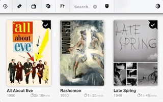
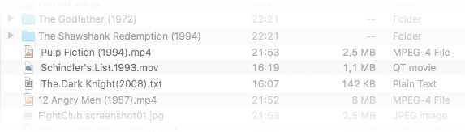
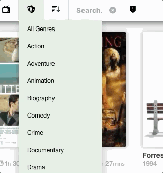

MovieCatalog
========

## What is MovieCatalog?
**Movie Catalog** is a python script that fetches movie data from various sources (imdb,tmdb,youtube,google) and generates a user-friendly catalog for all the movies the user has inside a folder. I created it to best manage my watchlist and quickly scan for movie information without jumping from site to site. It can work however on things such as movie files, screenshots, subtitle collections, or torrent files, or simple text files as long as the filenames are indicative of a movie.

The resulting catalog can be found inside the `index.html` file. 

    (!) MovieCatalog is NOT a movie downloader.

## How does MovieCatalog find which movies to download data for?
**MovieCatalog** is filesystem-based meaning that it scans a specific folder (*Source*) for files and folders (eg. .srt files, video files, .torrent files or .txt files) and fetches the information for the movies extracted from the filenames. In other words, it treats the folder's content, as a list of movie names. The downloaded data are kept in a `cache` folder.

## Features
### Runs on demand
**MovieCatalog** does not run in the background but can be automated to run when a file is added or removed from a folder (eg via smart folders/Automator) - The .py script updates the catalog by scanning changes in the *Source* folder, fetching the data and rebuilding the monolithic `index.html` file and then quits. 
### Is filesystem-based
You need only manage your movie files (Source). The script makes sure that there is parity between the source movie files/folders and the cached data. If a movie exists and its cache doesn't, it fetches the data. If a movie no longer exists, it deletes the orphaned cache silently.
### Contains various filters for data sorting/filtering
Supports various sorting options, as well as filtering by media type (movie,tv series) or combined genres (by pressing `Cmd`/`Ctrl`)

**MovieCatalog** allows full-text searching inside keywords, synopsis, cast and crew data, alternative titles, ratings and things such as the release year etc.

### Other features
The MovieCatalog `index.html` page is responsive, allows switching between light/dark mode easily and links to trailers in order to provide a one-stop experience to the user.
It displays the Director of Photography/Cinematographer since I find it quite important. There are links for the movies/shows and the cast/crew members to their respective IMDB and TMDB pages.

## Installation
1. Copy the files `main.py`,`DefaultSettings.py`,`templates/` and `resources/` into a folder
2. Install Python3, get the dependencies (requirements.txt) and build the environment.
3. In order to use the script, you need a free account at http://www.themoviedb.org
  - request a free API key at https://developers.themoviedb.org/3/getting-started/introduction
  - open the file `DefaultSettings.py` and paste the API key inside the quotes of `myTMDB_APIkey='__________________'`
4. Find the absolute path of the folder where the movies are,
  - open the file `DefaultSettings.py` and paste the absolute path inside the quotes of `SourcePath=''` eg. `SourcePath='/Users/User1/MyFiles/Movies/'`
5. Save the file.

## Usage
### Basic Usage
- run `main.py -s` to **scan** for new/deleted movie files and then rebuild the html file. When importing many files, there may be some random waiting intervals to prevent blacklisting on google.com
- open `index.html` in your browser
### Changing mismatches
If the movie was matched to the wrong IMDB id, or not matched at all, or incomplete data was fetched:
- run `main.py -l unimported` (unimported or all,ambiguous,verified,incomplete) to **display** the files that were affected.
- run `main.py -c -f <filename> -i <new imdbID>` with the filename and the correct IMDB ID(eg.`main.py -c -f 'Vertigo.mp4' -i 0052357`)
### Other usage
- run `main.py` to **rebuild** the `index.html` without scanning for new/deleted files
- run `main.py -?` displays command-line parameters

### notes using with pipenv/pip3
pipenv run python3 main.py -s

## Limitations/Compatibility
It has been tested on Opera, Firefox and Safari and Python3.
Tested with 700 movies. Since there is no actual database on the backend, more files mean slower performance overall

## future work
- [ ] get rid of the command-line interface and allow movie-meta editing via the app (django/flask)
- [ ] store data in an SQL database
- [ ] allow import from imdb watchlist
- [ ] allow scanning multiple locations
